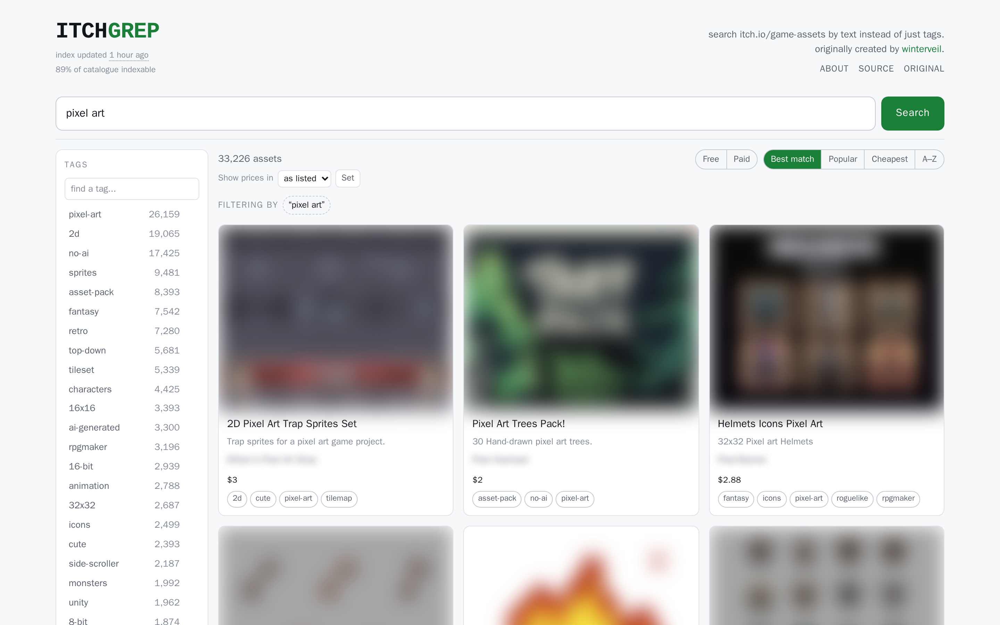
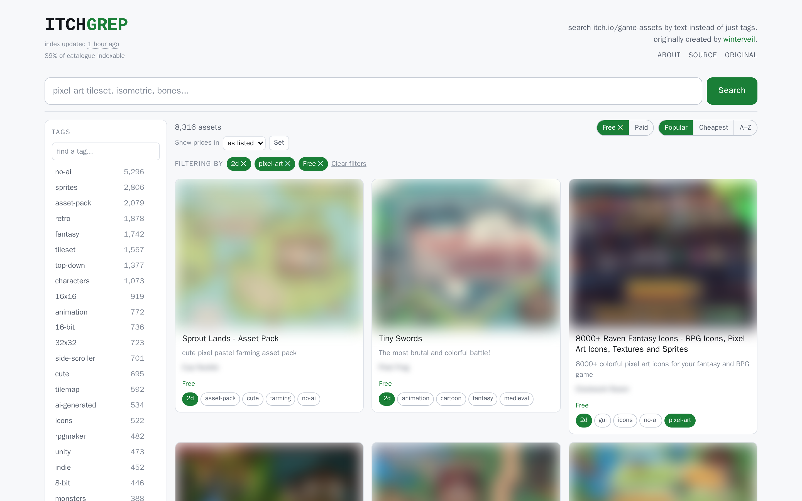
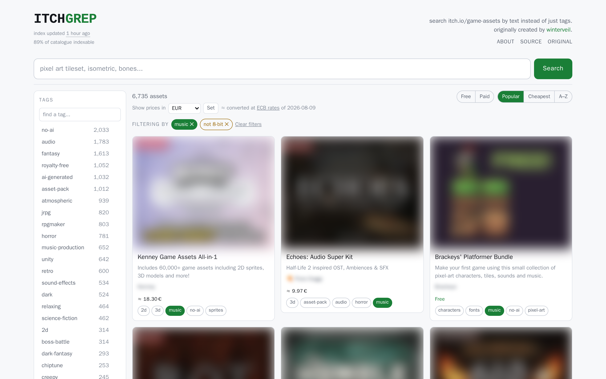

<!-- LTeX: language=en-US -->

# itchgrep

Full-text search over the itch.io game-asset catalogue, running at
[itchgrep.com](https://itchgrep.com/).

itch.io offers no text search scoped to assets — you browse by tag, and any one
view stops at roughly 7,200 results, so whatever ranks below that is unreachable
however you page. itchgrep indexes the catalogue in full and searches titles,
descriptions, tags and authors at once, adding tag exclusion, unlimited tag
combinations, cross-currency price comparison and live facet counts on top.



<sub>Cover art and creator names are blurred in these screenshots; they belong to
the asset authors, not to this project. Everything else is the real UI against a
real index.</sub>

## Credit

itchgrep was created by [winterveil](https://github.com/wintermute-cell); the
original lives at
[wintermute-cell/itchgrep](https://github.com/wintermute-cell/itchgrep). This
repository is a fork, licensed as the original under GPL-3.0, and is not
operated by the original author.

## Disclaimer

This fork was created, updated and "enhanced" using
[Claude Code](https://claude.com/claude-code), Anthropic's coding agent. Almost
everything added on top of winterveil's original — the crawl planner, the search
and filtering, the UI, the tests and this README — was written by it under human
direction and review.

That is stated plainly rather than buried: it is running in production and the
tests pass, but it is agent-written code, and you should read it before you
trust it with anything of yours.

## What you can search

A query matches four fields at once, weighted by how much a hit in each is
worth:

| Field | Weight | |
| --- | --- | --- |
| `Tags` | ×4 | A deliberate label, not a coincidence of prose |
| `Title` | ×3 | |
| `Description` | ×2 | **itch.io displays this line but never searches it** |
| `Author` | ×1 | |

Each query runs three passes and unions them: exact (×6), fuzzy at a 4-character
prefix (×4), and fuzzy at a 2-character prefix (×2). `tilset` finds tilesets
while the correct spelling still ranks first. Quoted text bypasses all of it and
matches as an adjacent phrase.

Seven more fields exist to filter, sort and count rather than to be searched:
tag slugs and author keys as indivisible keywords (so `pixel-art` is one term,
not `pixel` + `art`), a free/paid flag, a dollar-normalised price, and itch.io's
own popularity and newest ranks.

### What itch.io cannot do

- **Page past ~7,200 assets in a view.** itch.io serves at most 200 pages of
  any one browse view, so a popular tag has a floor you cannot page below.
- **Combine more than two tags.** A third is a `403`.
- **Exclude a tag.** There is no "NOT tag" facet in its URL grammar at all.
- **Compose filters.** A sort plus two tags is a `403`; a sort plus a price
  filter is a `403`.
- **Compare prices across currencies.** Sellers price in ~24 of them, so
  "under $5" is not a question itch.io can answer.
- **Count facets.** No indication of how many results a co-tag would leave.

What itch.io has that this does not is authority: it is current to the second,
and it knows about everything the last crawl missed.



## URL reference

Everything the UI can do is expressed in the URL, so any view is a link you can
share, bookmark or reload:

```
/                                   the catalogue, most popular first
/?q=pixel+art                       full-text search
/?q="pixel art"                     quoted terms match as a phrase
/?tags=2d,pixel-art                 require tags  (AND)
/?not=3d                            exclude tags
/?author=ana                        one creator
/?price=free                        free  (or paid, under-5, under-20)
/?sort=title                        A-Z  (or popular, relevance, price, recent)
/?cur=EUR                           show prices converted to euros
/?q=tileset&tags=2d&not=3d&price=under-5    all of it at once
```

Every control is a plain link with htmx layered on top, so search, filters,
sorting and paging all work with JavaScript disabled. The currency picker is a
plain GET form for the same reason.

A few behaviours are worth knowing:

- **The masthead states its own coverage.** Alongside the index age, the site
  reports what fraction of itch.io's catalogue it actually holds. A count with
  no denominator invites the reading that it is everything, which turns "no
  results" into false evidence that an asset does not exist.
- **Tags combine with AND.** The sidebar counts tags carried by the *current*
  results, so it maps where the remaining matches are rather than describing the
  36 on screen. Each row also offers a `−` that excludes the tag instead.
- **Free versus paid is read from the listing, not inferred.** A
  pay-what-you-want asset with a `$0` minimum carries a price *tag* but no price
  *value*, and itch.io counts it as free. Pay-what-you-want is recorded
  separately and shown as "Name your price", because an author asking for a
  voluntary payment is doing something different from giving the asset away.
- **"Recently added" is not a sort by date.** itch.io's markup carries no
  publication date; this orders by position in itch.io's newest view, which only
  reaches ~7,200 assets. The control is hidden when the index carries no ranks.
- **Bounded price filters need converted prices.** `under-5` and `under-20` are
  ranges over a dollar value baked in at index time. They are hidden on an index
  built without one, rather than returning an empty page.



### Exchange rates

At the end of every crawl the dataservice fetches the [ECB daily euro reference
rates](https://www.ecb.europa.eu/stats/eurofxref/eurofxref-daily.xml) and stores
them as `rates.json` beside the index. They are fetched *with* the index because
the dollar value used for `under-5` and `sort=price` is baked into each
document, so the rates the index was built with must be the rates the site
explains itself with. On failure the last snapshot is reused, then a table baked
into the binary.

Converted figures are approximate and presented that way: `≈` on the badge, the
original price and rate date on hover, and a link to the source under the picker.

## Running it

`docker` is the only dependency:

```bash
docker compose up --build
```

This runs the `dataservice`, triggers a full crawl and index of itch.io, and
brings up the `webserver` on [localhost:8080](http://localhost:8080) straight
away — it does not wait for the crawl.

> Use `--build` after any change to the Go source. Plain `docker compose up`
> reuses the previous image and will silently run stale code.

The first run crawls the whole catalogue (~108,000 assets) at a deliberately
polite 2 requests/second, so expect around six hours. Progress is in the
`dataservice` logs. Results live in the `itchgrep-data` volume, so later runs
come up immediately.

The webserver stays up throughout. On the first run it answers `503` until the
crawl publishes; on later runs it serves the *previous* index and swaps
atomically when the new one lands, so there is no downtime.

Both services share one volume at `/data` (`DATA_DIR`), and that directory *is*
the storage layer: `assets.json`, `tags.json`, `checkpoint.json` and
`index.bleve/`. Writes land in a temporary file and are renamed into place, so a
reader never sees a half-written file.

The index rebuilds itself once it is older than `CRAWL_INTERVAL` (a week by
default). That check runs against the timestamp of the data on disk rather than
a timer started at boot, so restarts — updates, reboots, a nightly backup — do
not postpone it.

- Re-crawl now, without waiting: `curl http://localhost:8081/trigger-fetch`
- Throw away all scraped data: `docker compose down -v`
- Generate `.go` from `.templ` files: `task templ` (not required to build; it
  just stops the language server complaining)

To run the services directly instead of via Compose:

```bash
DATA_DIR=./data go run ./cmd/dataservice   # then curl localhost:8080/trigger-fetch
DATA_DIR=./data PAGE_SIZE=36 go run ./cmd/webserver
```

### Configuration

Settings are environment variables. The portable way — identical in bash,
PowerShell and cmd — is a `.env` file next to `docker-compose.yml`, which
Compose reads automatically:

```
cp .env.example .env      # `copy` on Windows
```

| Variable | Default | Purpose |
| --- | --- | --- |
| `CRAWL_INTERVAL` | `168h` | Rebuilds the index whenever the published one is older than this. `0` disables it, leaving `/trigger-fetch` as the only way to refresh. |
| `SCRAPE_RPS` | `2` | Outbound requests/second, retries included. Fixed — the fetcher never speeds up or slows down on its own. |
| `SCRAPE_MAX_PAGES` | unset | Caps total pages across every view, for smoke-testing the whole pipeline. Also disarms `COVERAGE_FLOOR`. |
| `COVERAGE_TARGET` | `0.95` | Stops the crawl once that fraction is collected. Never triggers in practice. |
| `COVERAGE_FLOOR` | `0.75` | Refuses to publish below this, leaving the previous index in place. **Keep it below ~0.89** or it rejects every healthy run. |
| `INDEXER_TIMEOUT_SECONDS` | `43200` | How long the bootstrap container waits for the first crawl before reporting failure. |
| `SLICE_MIN_YIELD` | `0.05` | Abandons a view once it stops yielding new assets. Assets appear in ~5 views each, so without it overlap dominates. |
| `CHECKPOINT_MAX_AGE` | `24h` | How stale a checkpoint may be before it is ignored. Crawls checkpoint every 3 minutes and resume rather than restart. |
| `TAG_CACHE_MAX_AGE` | `168h` | How long `tags.json` is reused before tags are rediscovered. |
| `MAX_TAGS` | `1000` | Upper bound on the discovered tag vocabulary. |
| `PAGE_SIZE` | `36` | Assets per page of results. |
| `RATE_LIMIT_RPS` | `5` | Per-client limit on the webserver; `0` disables. |
| `TRUST_PROXY_HEADERS` | `false` | Read `CF-Connecting-IP` for rate limiting. See below. |

> **If you see a flood of 429s, check the cookie jar before touching
> `SCRAPE_RPS`.** itch.io sets an `itchio_token` cookie and refuses cookieless
> clients about half the time no matter how slowly they ask — measured at 8/16
> requests refused without the jar versus 0/16 with it. That failure looks
> exactly like an aggressive rate limit and cannot be fixed by slowing down. The
> `429s:` counter in the progress log makes it visible.

### How the crawl reaches the whole catalogue

itch.io serves at most 200 pages per browse view (~7,200 assets) while the
catalogue holds ~108,000, so paging `/game-assets` alone reaches under 7% of it.
The crawl gets past that by fetching many *filtered* views and deduplicating by
`GameId`. The URL grammar it accepts is narrow, and violating it fails loudly:

```
/game-assets                    root
/game-assets/<sort>             newest | new-and-popular | top-rated
/game-assets/tag-A              any single tag
/game-assets/<sort>/tag-A       sort plus one tag
/game-assets/tag-A/tag-B        two tags, default sort only, A < B
/game-assets/<filter>           free | store | last-30-days | genre-*
/game-assets/<filter>/tag-A     filter plus one tag
```

Anything else is a `403` or a `301`, so views cannot be subdivided arbitrarily
and coverage is the *union* of views — which is why it is measured rather than
assumed. The plan rests on one observation: an asset is fully reachable if it
carries at least one tag small enough to page through. Assets carry ~5 tags each
and most tags are small, so a view per small tag covers the majority; big tags
are taken under every ordering and filter, and the remainder is reached by
pairing big tags with each other.

**A full crawl reaches about 89%** — measured at 96,903 of 108,808, over 40,465
pages in ~6 hours, with zero rate-limit responses. The remainder is assets
ranking below the 200-page cutoff in *every* view they appear in, so no
reachable URL exposes them.

## Hosting it publicly

Both services run on one box behind a reverse proxy. The webserver listens on
8080 and is the only thing that should ever be exposed.

> **Never proxy port 8081.** That is the dataservice, and `/trigger-fetch` takes
> no authentication. A public route to it lets anyone start a multi-hour crawl.

### Behind Cloudflare

Use a Tunnel (`cloudflared`) rather than opening a port: the connection is
outbound, so there is no port forward, no static IP, and your origin address
never appears in DNS. `docker-compose.yml` carries it as an opt-in `public`
profile, so a local run never needs a Cloudflare account.

1. In the Cloudflare dashboard, add the domain and let it serve DNS (nameserver
   change at the registrar; propagation is usually under an hour).
2. Zero Trust → Networks → Tunnels → create a tunnel, and copy its token.
3. Put it in `.env` as `CLOUDFLARE_TUNNEL_TOKEN=…`, and set
   `TRUST_PROXY_HEADERS=true` in the same file.
4. Add a public hostname: `itchgrep.com` → `HTTP` → `webserver:8080`. The
   **service name**, not `localhost` — cloudflared resolves it over the compose
   network. Add `www` as a second hostname or a redirect rule.
5. `docker compose --profile public up -d`

`TRUST_PROXY_HEADERS` makes the rate limiter read `CF-Connecting-IP`. Behind a
tunnel every request arrives from the same address, so without it the whole
internet is one client. Leave it **off** if the server is directly exposed — the
header is attacker-controlled there, and honouring it would let any client mint
a new identity per request.

### Before going public

- Search and browse are `GET`s sending `Cache-Control: public, max-age=300`, so
  a proxy serves repeats of a popular query without touching the origin. This is
  why search is not a `POST`: no shared cache stores those.
- The webserver holds the whole dataset in memory, and both the old and new
  index are open during a swap, so peak memory is roughly double steady state.
  With a ~740 MB index, give the container real headroom.
- You would be republishing scraped itch.io metadata. Nothing is mirrored —
  every result links back to itch.io — which is what makes the case defensible.
- Thumbnails hotlink `img.itch.zone`, so image bandwidth never crosses your
  connection. The flip side is that itch.io bears that cost and could block by
  `Referer`, which would break every thumbnail at once.

## Testing

```bash
go test ./...
```

No external services required.

## Contributing

- Please run [`go fmt`](https://go.dev/blog/gofmt) before opening a pull request.
- Beginners to open source are welcome; if something is unclear, ask in an issue.
- One issue per feature request.
- Before a larger contribution, open an issue to ask whether it would be welcome.
- Keep discussion in GitHub issues rather than other channels.
